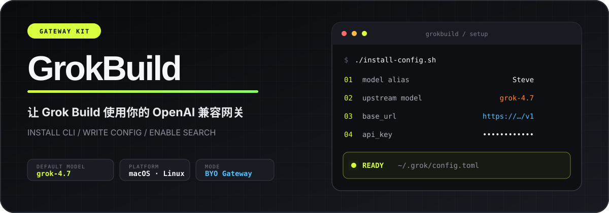

<div align="center">
  
</div>

<div align="center">
  <br />
  <strong>把 Grok Build CLI 接到你自己的 OpenAI 兼容网关。</strong>
  <br />
  <sub>安装 CLI · 交互生成配置 · 默认 grok-4.7 · 原生 Search / grok-search 可选</sub>
  <br /><br />

  <a href="#quick-start"></a> <a href="#configuration"></a> <a href="#search"></a> <a href="#security"></a>
</div>

<br />

<table>
  <tr>
    <td width="25%"><strong>MODEL</strong><br /><code>grok-4.7</code><br /><sub>主对话 / Responses 搜索</sub></td>
    <td width="25%"><strong>PLATFORM</strong><br />macOS · Linux<br /><sub>bash + curl</sub></td>
    <td width="25%"><strong>CONFIG</strong><br /><code>~/.grok/config.toml</code><br /><sub>自动备份 · 权限 600</sub></td>
    <td width="25%"><strong>SEARCH</strong><br />Native · Skill<br /><sub>按网关能力自由选择</sub></td>
  </tr>
</table>

> [!IMPORTANT]
> GrokBuild **不提供 API 密钥或网关服务**。安装过程中需要填写你自己的 `base_url` 与 `api_key`，真实密钥不会写入本仓库模板。

---

## 导航

<table>
  <tr>
    <td><a href="#quick-start"><strong>01 · 快速开始</strong></a></td>
    <td><a href="#wizard"><strong>02 · 配置向导</strong></a></td>
    <td><a href="#verify"><strong>03 · 验证安装</strong></a></td>
    <td><a href="#configuration"><strong>04 · 配置参考</strong></a></td>
  </tr>
  <tr>
    <td><a href="#search"><strong>05 · 联网能力</strong></a></td>
    <td><a href="#manual-install"><strong>06 · 手动安装</strong></a></td>
    <td><a href="#troubleshooting"><strong>07 · 故障排查</strong></a></td>
    <td><a href="#security"><strong>08 · 安全建议</strong></a></td>
  </tr>
</table>

---

<a id="quick-start"></a>

## 01 · 快速开始

### 一条命令完成安装

```bash
curl -fsSL https://raw.githubusercontent.com/zxfccmm4/GrokBuild/main/bootstrap.sh | bash
```

安装流程：

```text
Grok Build CLI
      ↓
下载配置模板与向导
      ↓
填写模型别名 / base_url / api_key
      ↓
写入 ~/.grok/config.toml
      ↓
可选安装 grok-search skill
```

| 阶段 | 执行内容 | 是否可跳过 |
|:---:|---|:---:|
| `01` | 安装 Grok Build CLI；检测到现有 `grok` 时自动跳过 | 是 |
| `02` | 下载 `config.toml` 与 `install-config.sh` | 否 |
| `03` | 交互生成 `~/.grok/config.toml` | 是 |
| `04` | 安装并配置 [grok-search](https://github.com/Autsunset/grok-search) | 是 |

> [!TIP]
> 已经安装 Grok CLI？使用 `SKIP_GROK_CLI=1`，只运行配置向导。

```bash
SKIP_GROK_CLI=1 curl -fsSL https://raw.githubusercontent.com/zxfccmm4/GrokBuild/main/bootstrap.sh | bash
```

<details>
<summary><strong>运行环境与前置条件</strong></summary>

<br />

| 项目 | 要求 |
|---|---|
| 操作系统 | macOS / Linux |
| 基础命令 | `bash` · `curl` |
| 网络 | 可访问 `x.ai` 与 GitHub |
| 配置目录 | 可创建 `~/.grok` |
| grok-search（可选） | `git` · Node.js ≥ 18.17 · `npm` |

</details>

<details>
<summary><strong>环境变量</strong></summary>

<br />

| 变量 | 作用 |
|---|---|
| `SKIP_GROK_CLI=1` | 跳过 Grok CLI 安装，只运行配置 |
| `SKIP_CONFIG=1` | 只安装 Grok CLI，不运行配置向导 |
| `SKIP_GROK_SEARCH=1` | 跳过 grok-search 安装步骤 |
| `GROKBUILD_WORKDIR=/path` | 将下载文件保留到指定目录，不自动清理 |
| `GROK_SEARCH_REPO` | 自定义 grok-search Git 仓库地址 |
| `GROK_SEARCH_DIR` | 自定义 skill 安装目录 |

```bash
# 只安装 Grok CLI
SKIP_CONFIG=1 curl -fsSL https://raw.githubusercontent.com/zxfccmm4/GrokBuild/main/bootstrap.sh | bash

# 只配置，不安装 CLI，也不安装 grok-search
SKIP_GROK_CLI=1 SKIP_GROK_SEARCH=1 \
  curl -fsSL https://raw.githubusercontent.com/zxfccmm4/GrokBuild/main/bootstrap.sh | bash
```

</details>

---

<a id="wizard"></a>

## 02 · 配置向导

向导将配置过程拆成可确认的步骤，不会静默覆盖已有配置。

| 顺序 | 向导项目 | 行为 |
|:---:|---|---|
| `1` | 模型别名 | 默认 `Steve`；同步写入 `[models].default` 与 `[model.别名]` |
| `2` | `base_url` | 必填；要求以 `http://` 或 `https://` 开头 |
| `3` | `api_key` | 必填；写入前允许再次确认 |
| `4` | Search Tool | 可选；配置原生 `web_search` / `x_search` |
| `5` | 写入确认 | 预览时自动隐藏 URL、密钥等敏感值 |
| `6` | grok-search | 可选；安装 `search` / `fetch` / `map` 脚本 |

### 写入保护

- 已有配置会先备份为 `~/.grok/config.toml.bak.<时间戳>`
- 预览中的 `api_key`、`base_url` 等敏感字段显示为 `***REDACTED***`
- 配置文件权限尽量设置为 `600`
- `base_url` 与 `api_key` 必须由用户填写，不使用仓库内默认密钥

<details>
<summary><strong>向导内部动作</strong></summary>

<br />

```text
检查 config.toml 模板
  ├─ 检查 / 创建 ~/.grok
  ├─ 读取模型别名
  ├─ 收集 base_url 与 api_key
  ├─ 可选写入原生 Search 字段
  ├─ 脱敏预览并确认
  ├─ 备份旧配置
  ├─ 写入新配置并设置权限
  └─ 可选安装 grok-search
```

</details>

---

<a id="verify"></a>

## 03 · 验证安装

### 检查 CLI

```bash
export PATH="$HOME/.grok/bin:$PATH"   # 当前 shell 找不到 grok 时执行

grok --version
grok
```

### 检查配置

```bash
ls -l ~/.grok/config.toml
cat ~/.grok/config.toml
```

> [!CAUTION]
> 分享终端输出、Issue 或截图前，请先删除真实 `api_key` 与网关地址。

### 最小对话测试

```text
用一句话介绍当前模型，并说明当前 reasoning effort。
```

启用 Search Tool 后可测试：

```text
请使用 web_search 查询最新的 xAI 公开新闻，并给出来源。
```

---

<a id="configuration"></a>

## 04 · 配置参考

Grok Build 默认读取：

```text
~/.grok/config.toml
```

### 默认配置概览

| 类别 | 默认值 |
|---|---|
| 本地模型别名 | `Steve` |
| 上游模型 ID | `grok-4.7` |
| Reasoning effort | `high` |
| Context window | `500000` |
| 遥测 / 反馈 | 关闭 |
| 代码库上传 | 关闭 |
| 权限模式 | `always-approve` |
| 原生 Search | 默认关闭，由向导选择 |

<details open>
<summary><strong>完整结构示例（已脱敏）</strong></summary>

<br />

```toml
[cli]
installer = "internal"

[models]
default = "Steve"             # 本地别名，与下方 [model.名称] 一致
default_reasoning_effort = "high"
# web_search = "Steve"        # 开启 Search Tool 时由向导写入

[model.Steve]
model = "grok-4.7"            # 上游真实模型 ID
base_url = "***REDACTED***"   # 安装时填写
name = "grok-4.7"
api_key = "***REDACTED***"    # 安装时填写
context_window = 500000
supports_reasoning_effort = true
reasoning_efforts = ["low", "medium", "high"]
# api_backend = "responses"           # Search Tool 开启时写入
# supports_backend_search = true      # Search Tool 开启时写入

[features]
telemetry = false
feedback = false

[telemetry]
trace_upload = false
mixpanel_enabled = false

[harness]
disable_codebase_upload = true

[ui]
max_thoughts_width = 120
fork_secondary_model = "grok-build"
yolo = false
compact_mode = false
permission_mode = "always-approve"
```

</details>

### `[models]` — 默认模型选择

| 字段 | 示例 | 说明 |
|---|---|---|
| `default` | `"Steve"` | 本地配置别名，必须对应一个 `[model.名称]` |
| `default_reasoning_effort` | `"high"` | 可用值：`low` / `medium` / `high` |
| `web_search` | `"Steve"` | 可选；内置 `web_search` 使用的模型别名 |

> [!NOTE]
> `default` 是本地别名，不是发给 API 的模型 ID。真正的上游 ID 位于 `[model.名称].model`。

### `[model.名称]` — 上游接口

| 字段 | 必填 | 说明 |
|---|:---:|---|
| `model` |  | 上游模型 ID，默认 `grok-4.7` |
| `base_url` | **是** | OpenAI 兼容根地址，例如 `https://api.example.com/v1` |
| `api_key` | **是** | 访问密钥，请勿提交到 Git |
| `name` |  | 展示名 |
| `context_window` |  | 上下文上限，模板默认 `500000` |
| `supports_reasoning_effort` |  | 是否支持 reasoning effort |
| `reasoning_efforts` |  | 可选档位列表 |
| `api_backend` |  | 原生 Search 开启时使用 `responses` |
| `supports_backend_search` |  | 声明网关支持后端搜索 |

### 常用修改

#### 降低推理强度

```toml
[models]
default_reasoning_effort = "medium"  # 或 "low"
```

#### 收紧工具权限

保持 `yolo = false`，并将 `[ui].permission_mode` 改为当前 Grok 版本支持的更严格选项。可用值以 `~/.grok/docs` 中的本机版本文档为准。

#### 切换默认别名

```toml
[models]
default = "MyProxy"

[model.MyProxy]
model = "grok-4.7"
base_url = "https://你的网关/v1"
name = "grok-4.7"
api_key = "你的密钥"
context_window = 500000
supports_reasoning_effort = true
reasoning_efforts = ["low", "medium", "high"]
```

修改后重新启动 `grok` 或新建 session。

<details>
<summary><strong>隐私、遥测与 UI 字段</strong></summary>

<br />

| 配置段 | 字段 | 默认值 | 作用 |
|---|---|---|---|
| `[features]` | `telemetry` | `false` | 关闭遥测功能 |
| `[features]` | `feedback` | `false` | 关闭反馈功能 |
| `[telemetry]` | `trace_upload` | `false` | 禁止上传 trace |
| `[telemetry]` | `mixpanel_enabled` | `false` | 关闭 Mixpanel |
| `[harness]` | `disable_codebase_upload` | `true` | 禁止代码库上传 |
| `[ui]` | `max_thoughts_width` | `120` | 思考区域最大宽度 |
| `[ui]` | `fork_secondary_model` | `grok-build` | fork 使用的辅助模型 |
| `[ui]` | `compact_mode` | `false` | 是否启用紧凑模式 |
| `[ui]` | `permission_mode` | `always-approve` | 工具权限策略 |

</details>

---

<a id="search"></a>

## 05 · 联网能力

GrokBuild 支持两条互不依赖的联网路径。

|  | 原生 Search Tool | grok-search skill |
|---|---|---|
| 运行位置 | 网关 / Responses 后端 | 本地 Node.js 脚本 |
| 配置文件 | `~/.grok/config.toml` | `~/.config/grok-search/config.json` |
| 能力 | `web_search` / `x_search` | `search` / `fetch` / `map` |
| 适合场景 | 网关已原生支持搜索 | 网关无原生搜索，或需要独立抓取工具 |
| 默认模型 | `grok-4.7` | Responses：`grok-4.7`；Chat：`grok-4.3-fast` |

> [!TIP]
> 两种方案可以同时安装，但同一问题建议只走一条搜索路径，避免重复联网和重复计费。

### A · 原生 Search Tool

开启后，向导会写入以下字段：

```toml
[models]
web_search = "Steve"

[model.Steve]
api_backend = "responses"
supports_backend_search = true
```

适用条件：

- 网关支持 Responses 风格请求
- 网关已实现后端 `web_search` / `x_search`
- 上游模型和网关均允许搜索工具调用

关闭时删除或注释以上三项，并重新启动 `grok`。

> `x_search` 没有独立客户端工具，依赖服务端注入；仅设置本地字段并不能让不支持搜索的网关获得搜索能力。

### B · grok-search skill

[grok-search](https://github.com/Autsunset/grok-search) 是独立维护的第三方 Skill。

| 脚本 | 用途 |
|---|---|
| `search.js` | 使用 Chat / Responses 联网，可并行 Tavily / Firecrawl |
| `fetch.js` | 抓取 URL 并提取可读正文 |
| `map.js` | 发现站点内候选页面 |

向导会：

1. 检查 `git`、Node.js ≥ 18.17 与 `npm`
2. Clone 或更新到 `~/.grok/skills/grok-search`
3. 安装缺失依赖
4. 选择 `chat` 或 `responses` 协议
5. 选择搜索模型 ID
6. 复用本次 `base_url` / `api_key` 写入独立配置
7. 可选运行连通性测试

<details>
<summary><strong>手动安装与测试 grok-search</strong></summary>

<br />

```bash
git clone https://github.com/Autsunset/grok-search.git ~/.grok/skills/grok-search
cd ~/.grok/skills/grok-search
npm install

mkdir -p ~/.config/grok-search
# 按 grok-search 上游 README 编辑 config.json
chmod 600 ~/.config/grok-search/config.json
```

```bash
node ~/.grok/skills/grok-search/scripts/search.js --no-extra "随便搜个新闻"
node ~/.grok/skills/grok-search/scripts/fetch.js https://example.com
node ~/.grok/skills/grok-search/scripts/map.js https://example.com --limit 5
```

Skill 安装到 `~/.grok/skills/` 后会由 Grok 自动发现。

字段关系：

| GrokBuild | grok-search `config.json` |
|---|---|
| `base_url` | `apiUrl`，只填 base，不附加 `/chat/completions` |
| `api_key` | `apiKey` |
| 原生 Search / Responses | `searchEndpoint: "responses"` |
| 常见中转快模型 | `searchEndpoint: "chat"` |
| `[model.*].model` | 独立的 `model` 字段，可与主对话模型不同 |

</details>

---

<a id="manual-install"></a>

## 06 · 项目结构与手动安装

### 仓库结构

```text
GrokBuild/
├── bootstrap.sh         # 安装 CLI + 下载文件 + 启动配置向导
├── install-config.sh    # 交互生成配置，可选安装 grok-search
├── config.toml          # 无真实密钥的配置模板
├── assets/readme/       # README 视觉资源
└── README.md
```

| 文件 | 职责 |
|---|---|
| [`bootstrap.sh`](./bootstrap.sh) | 串联安装、下载和配置流程 |
| [`install-config.sh`](./install-config.sh) | 收集参数、脱敏预览、备份并写入配置 |
| [`config.toml`](./config.toml) | 模型、隐私、遥测和 UI 默认模板 |

### 分步安装

#### 1. 安装 Grok Build CLI

```bash
curl -fsSL https://x.ai/cli/install.sh | bash
grok --version
```

```bash
# 指定版本 / 升级
curl -fsSL https://x.ai/cli/install.sh | bash -s 0.1.42
grok update
```

#### 2. 获取 GrokBuild

```bash
git clone https://github.com/zxfccmm4/GrokBuild.git
cd GrokBuild
```

不使用 Git 时，可以只下载向导文件：

```bash
mkdir -p GrokBuild && cd GrokBuild
curl -fsSL -o config.toml https://raw.githubusercontent.com/zxfccmm4/GrokBuild/main/config.toml
curl -fsSL -o install-config.sh https://raw.githubusercontent.com/zxfccmm4/GrokBuild/main/install-config.sh
chmod +x install-config.sh
```

也可以下载 ZIP：

```bash
curl -fsSL -o GrokBuild.zip https://github.com/zxfccmm4/GrokBuild/archive/refs/heads/main.zip
unzip GrokBuild.zip
cd GrokBuild-main
```

#### 3. 运行向导

```bash
./install-config.sh
```

#### 4. 完全手动写入

```bash
mkdir -p ~/.grok
cp config.toml ~/.grok/config.toml
$EDITOR ~/.grok/config.toml
chmod 600 ~/.grok/config.toml
```

### 恢复备份

```bash
ls ~/.grok/config.toml.bak.*
cp ~/.grok/config.toml.bak.<时间戳> ~/.grok/config.toml
```

---

<a id="troubleshooting"></a>

## 07 · 故障排查

| 现象 | 检查与处理 |
|---|---|
| 当前 shell 找不到 `grok` | 执行 `export PATH="$HOME/.grok/bin:$PATH"`，或重新打开终端 |
| 找不到 `config.toml` | 在仓库根目录运行 `./install-config.sh` |
| 模型别名格式无效 | 使用 `Steve`、`MyProxy`、`work-grok` 等合法别名 |
| `base_url` 无效 | 使用完整根地址，例如 `https://host/v1`；不要包含空格 |
| 模型连接失败 | 检查 `base_url`、`api_key`、模型 ID 与服务商控制台 |
| 原生 Search 报错 | 检查网关是否支持 Responses 与后端搜索；必要时关闭原生 Search |
| 对话没有联网 | 新建 session，并检查 `web_search` 或 skill 是否正确安装 |
| grok-search 安装失败 | 安装 Node.js ≥ 18.17、`git`、`npm`，再运行 `npm install` |
| `search.js` 返回 401 | 检查 `apiKey` 与网关鉴权格式 |
| `search.js` 返回 404 / 422 | 检查 `searchEndpoint` 与模型 ID 是否匹配 |
| 修改配置后行为未变化 | 重启 `grok` 或新建 session |
| 需要撤销修改 | 从 `config.toml.bak.<时间戳>` 恢复 |

Grok CLI 本体文档通常位于：

```text
~/.grok/README.md
~/.grok/docs/user-guide/
```

---

<a id="security"></a>

## 08 · 安全建议

<table>
  <tr>
    <th align="left">推荐</th>
    <th align="left">避免</th>
  </tr>
  <tr>
    <td>安装时在本机填写真实密钥</td>
    <td>将真实 <code>api_key</code> 提交到 Git</td>
  </tr>
  <tr>
    <td>为配置文件设置 <code>600</code> 权限</td>
    <td>在 Issue、聊天或截图中暴露密钥</td>
  </tr>
  <tr>
    <td>公开分享前再次检查配置与日志</td>
    <td>把带鉴权信息的 URL 写入 README</td>
  </tr>
  <tr>
    <td>根据组织策略收紧 permission mode</td>
    <td>在不可信机器上长期保存高权限密钥</td>
  </tr>
</table>

```bash
chmod 600 ~/.grok/config.toml
chmod 600 ~/.config/grok-search/config.json 2>/dev/null || true
```

---

## 许可与边界

- 本仓库提供 **配置模板与安装辅助脚本**，不包含 Grok CLI 本体
- `api_key` 与网关地址由使用者自行申请、验证和保管
- 隐私、遥测与权限默认值应根据个人或组织合规要求调整
- [grok-search](https://github.com/Autsunset/grok-search) 是第三方 MIT 项目，与本仓库独立维护

---

<div align="center">
  <strong>GrokBuild</strong><br />
  <sub>Own the endpoint. Keep the workflow.</sub>
  <br /><br />
  <a href="#quick-start">快速开始</a>
  ·
  <a href="#configuration">配置参考</a>
  ·
  <a href="#search">联网能力</a>
  ·
  <a href="https://github.com/zxfccmm4/GrokBuild">GitHub</a>
</div>
